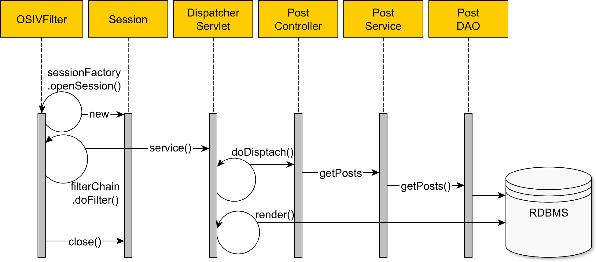

class: center, middle
# How to work with a DB in Java

[Source code on Github](https://github.com/linarkou/spring-data-jpa-demo)
---
## В предыдущем докладе
```$java
Connection conn = DriverManager.getConnection("jdbc:mysql://localhost:3306/test","root","root");  
Statement stmt = conn.createStatement();  
ResultSet rs = stmt.executeQuery("select * from table");  
```
--
.center.middle[**Так никто не делает, забудьте!**]

---
## Термины
**ORM** (*Object Relationship Mapping*) - концепция маппинга объектов в ООП на таблицы в реляционных БД.
--


**JPA** (*Java Persistence API*) - спецификация в Java EE, 
предоставляет возможность сохранять в удобном виде Java-объекты в базе данных
 (то есть реализует концепцию ORM).
???
Для удобства работы с объектами из баз данных придумали ORM<br/>
В джаве эту концепцию реализовали в спецификации JPA
--


**Hibernate** - наиболее распространенная реализация JPA.
---
## Основные аннотации в JPA
* `@Entity`
* `@Id` - помечает поле в качестве первичного ключа
* `@OneToOne`, `@OneToMany`, `@ManyToOne`, `@ManyToMany` - связи между сущностями
* `@Table` - указать название таблицы (по умолчанию = названию класса)
* `@Column` - указать название колонки (по умолчанию = названию поля в классе)
* ...

.center[**Посмотрим на примере**]

---
## Spring Data
Spring Data включает в себя много проектов:
* **Spring Data JPA** - репозитории с поддержкой JPA. Удобно, но много магии.
* **Spring Data JDBC** - репозитории с поддержкой JDBC. Без магии, кэширования и ленивой загрузки.<sup>[1]</sup>
* **Spring Data Rest** - если нужно отдавать результаты SQL-запросов сразу по REST'у.<sup>[2]</sup>
* **Spring Data KeyValue** - репозитории для поддержки key-value хранилищ (один из видов NoSQL).
* [...многое другое](https://spring.io/projects/spring-data)
.note[
1. https://habr.com/ru/post/423697/
]

???
В моем докладе я хочу рассказать по большей части про Spring Data JPA.

---
## Spring Data JPA
Основное понятие в Spring Data — это **репозиторий** - компонент для доступа в БД.

Для того, чтобы создать репозиторий, нужно:
* Нужно поставить на интерфейс(класс) аннотацию `@Repository`
* Унаследоваться от интерфейса `JpaRepository` или `CrudRepository`

---
## Первоначальная настройка Spring Data JPA
1. Spring Boot:
    * Добавить в maven зависимость `spring-boot-starter-data-jpa`
    * Добавить настройки подключения к БД в `application.properties`
2. Без Spring Boot:
    * добавить в maven зависимость на `spring-data-jpa`
    * настроить непонятные бины:
        * `DataSource`
        * `EntityManagerFactory`
        * `TransactionManager`

--
.center.middle[Давайте посмотрим пример]

---
## Open Session In View Anti-pattern
.center[]
.note[
[source: vladmihalcea.com](https://vladmihalcea.com/the-open-session-in-view-anti-pattern/)
]
---
## Кастомные запросы по названию метода
<a href="https://docs.spring.io/spring-data/jpa/docs/2.2.4.RELEASE/reference/html/#jpa.query-methods.query-creation" target="_blank">Spring Data @Query</a>

---
## Запросы через `@Query`
В репозиториях можно писать запросы на языке JPQL, очень похожем на SQL.

Также можно писать запросы на чистом SQL.

???
Это нужно для написания сложных запросов или для оптимизации существующих
* написать запрос через join fetch и поставить @Transactional в репозитории
---
## Итог
### Чтобы удобно работать с сущностью из БД, нужно:
--

0. Настроить доступ к БД
--


1. Создать `@Entity` с `@Id`
--


2. Создать интерфейс `@Repository`, который наследуется от `JpaRepository`
--


3. Все!

---
## Интересные ссылки
1. [Spring Data JPA: что такое хорошо, и что такое плохо](https://habr.com/ru/post/441386/)
2. [Spring Data JPA: доводим напильником](https://habr.com/ru/post/444240/)
